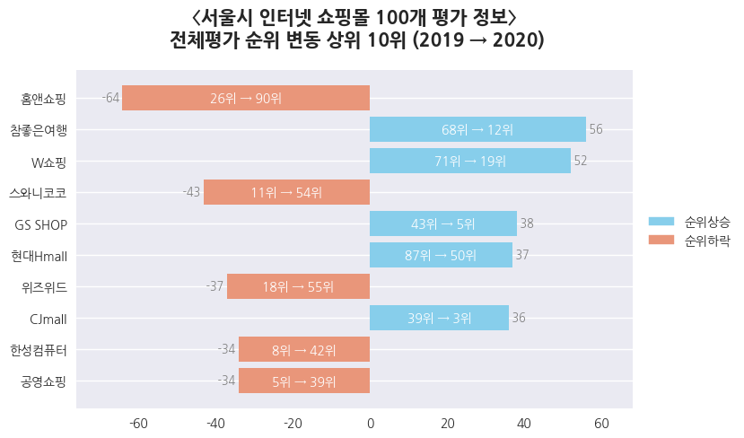
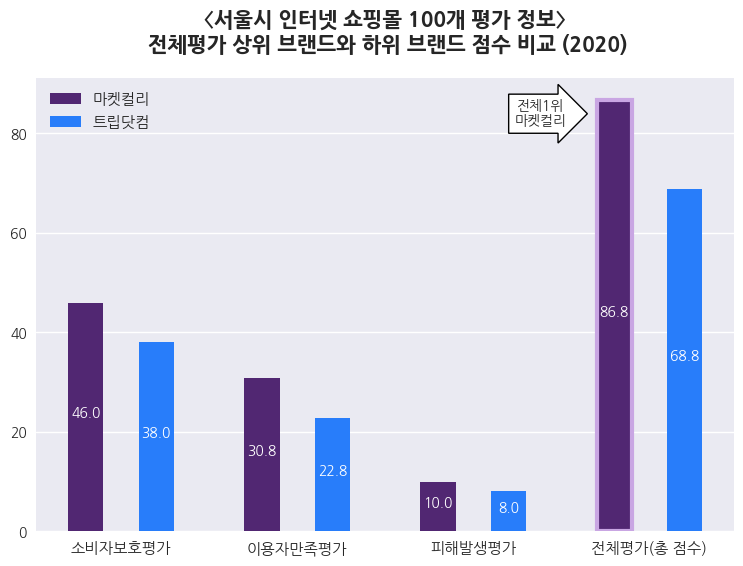
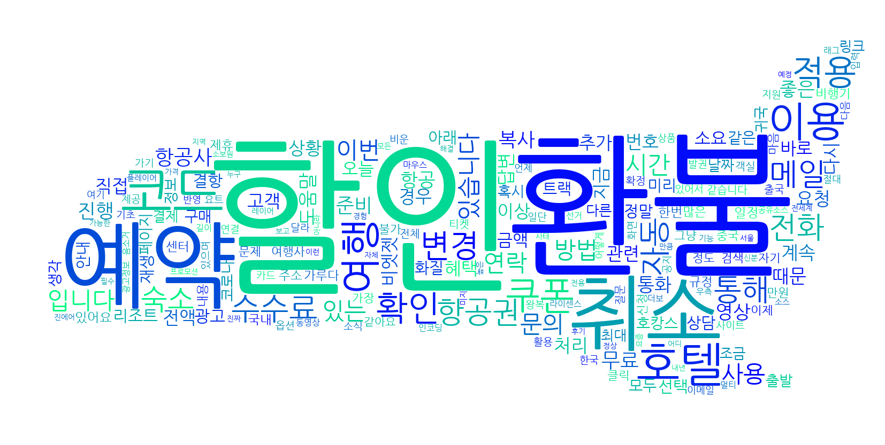

## 2019-2020 〈서울시 인터넷 쇼핑몰 100개 평가 정보〉 시각화 분석
서울시전자상거래센터는 인터넷 쇼핑몰 간 공정한 경쟁을 유도하고 정보에 기반한 소비자들의 구매를 돕기 위해 2007년부터 ‘인터넷 쇼핑몰 평가’를 진행하고 있다. 평가점수를 기반으로 하여 2019년도와 2020년도의 인터넷 쇼핑몰 시장 추세에 대해서 분석하고 연도별로 차이를 비교하는 프로젝트를 SQL로 진행하였다.  
:point_right: [[SQL Project] 서울시 인터넷 쇼핑몰 100개 평가 정보 분석](https://github.com/54data/Evaluation-of-100-Internet-Shopping-Mall-in-Seoul.git)

SQL로 진행한 분석 결과를 기반으로 Python으로 전체평가 순위 변동, 상하위 브랜드의 항목별 점수 비교를 그래프로 시각화하였다. 또한, 2020년도 기준 전체평가 최상위 브랜드와 최하위 브랜드의 소비자 인식을 조사하기 위하여 네이버 카페 크롤링을 진행하였고, 크롤링 결과를 형태소 분석하여 워드클라우드로 시각화하였다.  
 

### 1. 〈서울시 인터넷 쇼핑몰 100개 평가 정보〉 전체평가 순위 변동 상위 10위 (2019 → 2020) 그래프  
- 파이썬과 오라클을 연동하여 시각화할 데이터 추출하였다.  
- 2019년도 대비 2020년도 전체평가 순위가 변동한 데이터 중에서 가장 큰 순위변동이 있었던 상위 10개 브랜드의 변동 크기를 막대그래프로 시각화하였다.      
  

 

### 2. 〈서울시 인터넷 쇼핑몰 100개 평가 정보〉 전체평가 최상위 브랜드와 최하위 브랜드 비교 (2020)  
- 2020년도 전체평가 기준 최상위 브랜드인 '마켓컬리'와 최하위 브랜드인 '트립닷컴'의 카테고리별 세부 점수를 비교하여 막대그래프로 시각화하였다.  

 

### 3. 최상위, 최하위 브랜드 인식 조사를 위한 네이버 카페 크롤링  
- 〈서울시 인터넷 쇼핑몰 100개 평가 정보〉에 따르면 2020년도 전체평가 기준 최고 점수를 받은 브랜드는 '마켓컬리'이며 최하위점수를 받은 브랜드는 '트립닷컴'이다.  
- '마켓컬리'와 '트립닷컴'에 대한 내용을 담은 네이버 카페 글(제목, 내용, 댓글)을 크롤링하여 텍스트 파일로 생성했다.  
- 네이버 카페 검색 기준 : 일반글, 작성일자(2020/01/01-2020/12/31), 관련도 순으로 정렬  
- 함수로 생성하여 검색 키워드와 몇 개의 글을 크롤링 할 것인지를 입력하도록 하였다.  

### 4. 워드클라우드 시각화  
- 네이버 카페 글을 크롤링하여 얻은 텍스트 파일에서 명사와 형용사만 추출하고, 추출한 단어와 그 빈도수를 담은 딕셔너리를 만드는 함수를 생성했다.  
- 단어와 빈도수가 담긴 딕셔너리를 통해서 워드클라우드를 그리도록 하였다.  

#### 4-1) Okt를 이용해 형태소 추출 (명사, 형용사)  
#### 4-2) 워드클라우드 생성  

**
'마켓컬리' 워드클라우드
**  
**
'트립닷컴' 워드클라우드
**  
 

- 2020년도 전체평가 1위를 한 '마켓컬리'는 새벽배송 시장을 이끄는 대표기업인 만큼 워드클라우드 시각화에 '새벽'과 '배송' 등의 단어들이 나타났다.  
- 그에 비해, 최하위 점수를 받은 '트립닷컴'은 '환불'이나 '취소' 등의 단어가 나타났다. 코로나19가 발생한 이후에도 기존의 환불정책을 유지하다가 소비자들의 불만이 늘어난 것으로 보였다. 이는 '트립닷컴'이 소비자보호평가 부문에서 특히나 낮은 점수를 받은 원인이라고 볼 수 있다.  
